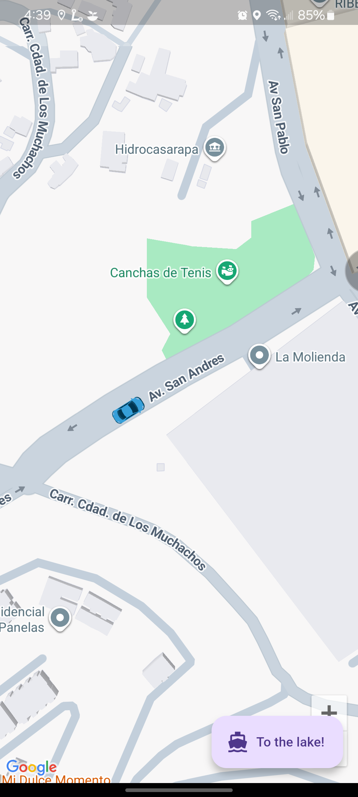
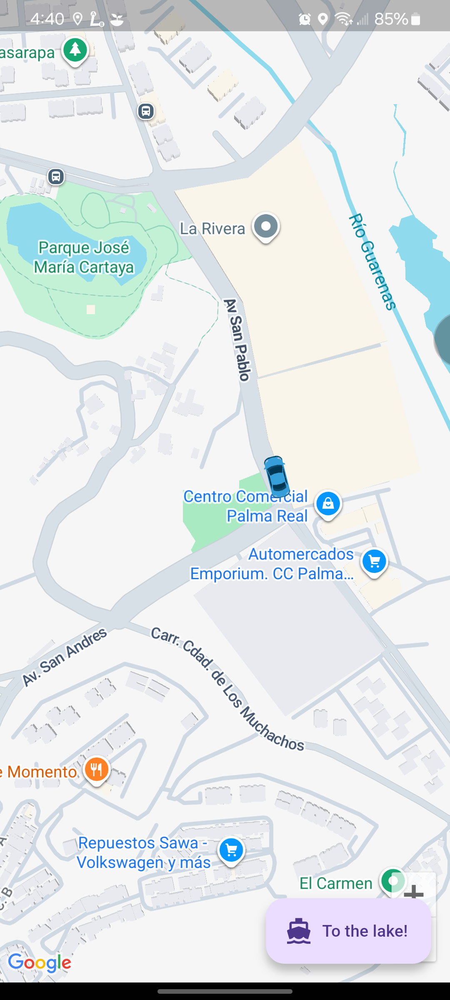

# Realk Time Tracking

Project to practice the integration between Google Maps and Flutter.

## ✅ Features
- Open Map
- Track car route

## ⚙️ Tech Stack
- flutter 3.7
- google_maps_flutter: ^2.14.0
- geolocator: ^14.0.2
- geocoding: ^4.0.0
- shared_preferences: ^2.5.3
- geolocator: ^14.0.0


## 💾 Installation

Install and run

1. Clone and move to folder
```bash
$ git clone git@github.com:abrahamuchos/real_time_car_tracking
$ cd real_time_car_tracking
```

2. Install dependencies
```bash
$  flutter pub get
```

3. Config Google Maps API key (_android/app/src/main/AndroidManifest.xml_)

```xml
<meta-data android:name="com.google.android.geo.API_KEY" android:value="YOUR_API_HERE"/>
```

4. Run dev `flutter run`

If you encounter issues, run `flutter doctor` to check for missing dependencies or configuration errors.


## 📄 Docs

[Real-Time Car GPS - CodeFoAny YouTube](https://www.youtube.com/playlist?list=PLzcRC7PA0xWSjlEWE0_VGBsZaRq-0iepr)
[Real Time Car - Backend Node.js - GitHub](https://github.com/codeforany/real_time_car_tracking_node)

## 📷 Screenshot




## 🧑‍💻 Authors
- [Portfolio - Abrahamuchos](https://abrahamuchos.onrender.com/)
- [@abrahamuchos](https://github.com/abrahamuchos)
- [Contact mail](mailto:abrahmuchos@gmail.com)
